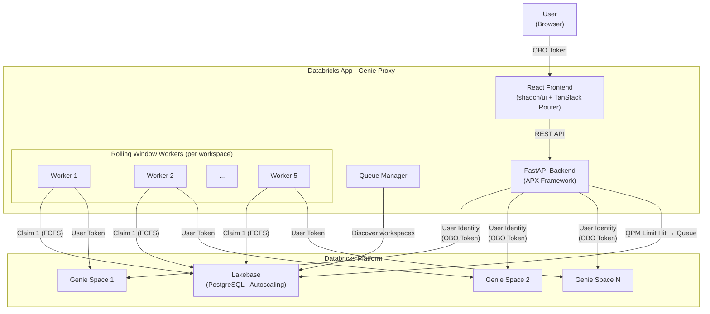
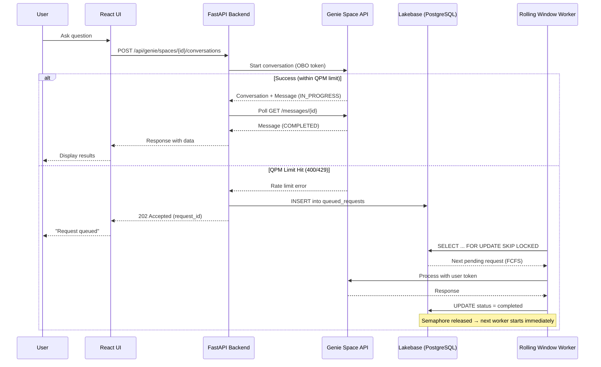
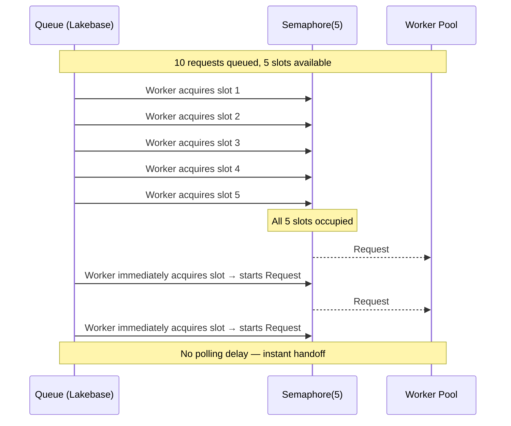

# Genie Proxy

A Databricks App that provides proxy access to one or more Genie Spaces across workspaces through an API, with intelligent request queuing backed by Lakebase when QPM rate limits are hit.

## Architecture



### Request Flow



### Rolling Window Queue Model



## Features

- **Multi-Space Access**: Browse and connect to multiple Genie Spaces across workspaces
- **User Identity (OBO)**: All Genie API calls use the authenticated user's identity via On-Behalf-Of token passthrough, never the service principal
- **Rolling Window Queue**: Up to 5 requests process concurrently per workspace (matching Genie API free tier QPM). When one finishes, the next starts immediately with zero delay
- **Workspace-Level QPM**: Queue is managed per workspace across all Genie spaces, matching the Genie API's per-workspace rate limit model
- **Queue Monitor**: Real-time dashboard with Current Run / History tabs, per-request timing (wait time + run time), and Genie space name badges
- **Queue Simulation**: Simulate queuing across multiple Genie spaces with round-robin distribution
- **Clear Queue**: One-click clear of all queue items
- **Atomic Dequeuing**: Uses PostgreSQL's `SELECT FOR UPDATE SKIP LOCKED` for reliable, concurrent-safe FCFS processing
- **Crash Recovery**: On startup, stuck PROCESSING requests are automatically reset to PENDING

## Tech Stack

| Layer | Technology |
|-------|-----------|
| Framework | [APX](https://github.com/databricks-solutions/apx) (FastAPI + React) |
| Backend | Python 3.11+, FastAPI, SQLModel, httpx, asyncio |
| Frontend | React 19, TypeScript, TanStack Router, TanStack React Query |
| UI Components | [shadcn/ui](https://github.com/shadcn-ui/ui) (Radix + Tailwind) |
| Database | Lakebase (Databricks managed PostgreSQL, Autoscaling) |
| Auth | Databricks Apps OBO (On-Behalf-Of) token passthrough |
| Deployment | Databricks Asset Bundles |

## Project Structure

```
genie-proxy/
├── databricks.yml              # DABs deployment config
├── app.yml                     # App entrypoint
├── pyproject.toml              # Python dependencies + APX metadata
├── package.json                # Frontend dependencies
├── .env_template               # Environment variable template
├── .gitignore
├── README.md
└── src/genie_proxy/
    ├── backend/
    │   ├── app.py              # FastAPI app entry
    │   ├── router.py           # API routes (Genie proxy + queue)
    │   ├── models.py           # SQLModel + Pydantic models
    │   ├── genie_service.py    # Genie Spaces API client (OBO)
    │   ├── queue_service.py    # Rolling window queue + workspace workers
    │   └── core/               # APX framework core
    │       ├── _config.py      # App configuration
    │       ├── _defaults.py    # WorkspaceClient dependencies
    │       ├── _headers.py     # OBO header extraction
    │       ├── lakebase.py     # DB engine + queue manager lifecycle
    │       └── dependencies.py # FastAPI DI shortcuts
    └── ui/
        ├── main.tsx            # React entry
        ├── routes/
        │   ├── index.tsx       # Landing page
        │   └── _sidebar/
        │       ├── route.tsx   # Sidebar layout + navigation
        │       ├── spaces.tsx  # Genie Space browser
        │       ├── chat.tsx    # Chat interface
        │       ├── queue.tsx   # Queue monitor (tabs, timing, simulation)
        │       └── profile.tsx # User profile
        ├── components/         # shadcn/ui + custom components
        ├── lib/
        │   └── api.ts          # Auto-generated API client + React Query hooks
        └── styles/globals.css  # Tailwind CSS
```

## API Endpoints

| Method | Path | Description |
|--------|------|-------------|
| `GET` | `/api/version` | App version |
| `GET` | `/api/current-user` | Current authenticated user |
| `GET` | `/api/genie/spaces` | List accessible Genie Spaces |
| `POST` | `/api/genie/spaces/{id}/conversations` | Start conversation |
| `POST` | `/api/genie/spaces/{id}/conversations/{cid}/messages` | Send message |
| `GET` | `/api/genie/spaces/{id}/conversations/{cid}/messages/{mid}` | Poll message status |
| `GET` | `/api/genie/spaces/{id}/.../query-result/{aid}` | Get query results |
| `GET` | `/api/queue` | List queued requests (with timing) |
| `GET` | `/api/queue/stats` | Queue statistics by status |
| `GET` | `/api/queue/{request_id}` | Get queue item details |
| `DELETE` | `/api/queue/clear` | Clear all queue items |
| `POST` | `/api/queue/simulate` | Simulate queued requests across spaces |

## Setup & Development

### Prerequisites

- Python 3.11+
- [Databricks CLI](https://docs.databricks.com/dev-tools/cli/index.html) configured
- [APX CLI](https://github.com/databricks-solutions/apx) installed
- Access to a Databricks workspace with Genie Spaces

### 1. Clone and configure

```bash
# Copy environment template
cp .env_template .env

# Edit .env with your workspace URL and optional space IDs
```

### 2. Local development

```bash
# Install apx CLI (if not already installed)
curl -fsSL https://databricks-solutions.github.io/apx/install.sh | sh

# Start dev server (backend + frontend + PGlite for local Lakebase)
apx dev start

# Check server status
apx dev status

# View logs
apx dev logs -f
```

The dev server provides:
- App at `http://localhost:9001`
- Backend with hot reload
- Frontend with HMR (Hot Module Replacement)
- PGlite sidecar for local PostgreSQL (no Lakebase needed locally)

### 3. Deploy to Databricks

```bash
# Build the app (frontend + backend into a single wheel)
apx build

# Deploy with Databricks Asset Bundles
databricks bundle deploy -t dev

# Run the app
databricks bundle run genie-proxy-app -t dev
```

## Queue Mechanism

### Throughput Model

The Genie API free tier allows **5 questions per minute per workspace** across all Genie spaces. The queue enforces this at the workspace level:

- Each workspace gets a pool of 5 concurrent worker slots (via `asyncio.Semaphore`)
- Workers use FCFS (First Come, First Served) ordering
- When one of the 5 finishes, the next pending request starts **immediately** (rolling window, no polling delay)
- Different workspaces process independently and don't block each other

### Queue Table Schema

```sql
CREATE TABLE queued_requests (
    id              SERIAL PRIMARY KEY,
    request_id      VARCHAR UNIQUE NOT NULL,
    user_email      VARCHAR NOT NULL,
    user_token      TEXT NOT NULL,
    space_id        VARCHAR NOT NULL,
    space_name      VARCHAR,
    workspace_url   VARCHAR NOT NULL,
    question        TEXT NOT NULL,
    conversation_id VARCHAR,
    status          VARCHAR DEFAULT 'pending',
    priority        INTEGER DEFAULT 0,
    attempt_count   INTEGER DEFAULT 0,
    max_attempts    INTEGER DEFAULT 5,
    error_message   TEXT,
    response_data   TEXT,
    created_at      TIMESTAMP WITH TIME ZONE,
    updated_at      TIMESTAMP WITH TIME ZONE,
    started_at      TIMESTAMP WITH TIME ZONE,
    completed_at    TIMESTAMP WITH TIME ZONE
);
```

### Dequeue Pattern

Uses PostgreSQL's `SELECT FOR UPDATE SKIP LOCKED` for atomic, concurrent-safe FCFS dequeuing scoped to workspace:

```sql
UPDATE queued_requests
SET status = 'processing', updated_at = NOW(), started_at = NOW()
WHERE id = (
    SELECT id FROM queued_requests
    WHERE status = 'pending'
      AND workspace_url = :workspace_url
      AND attempt_count < max_attempts
    ORDER BY priority DESC, created_at ASC
    LIMIT 1
    FOR UPDATE SKIP LOCKED
)
RETURNING id;
```

### Retry Logic

- QPM limit errors: re-queued with incremented attempt count
- Non-QPM API errors: marked as failed immediately
- Unexpected errors: re-queued for retry
- Maximum 5 attempts per request
- Crash recovery: PROCESSING requests reset to PENDING on startup

## Environment Variables

| Variable | Description | Required |
|----------|-------------|----------|
| `DATABRICKS_CONFIG_PROFILE` | Databricks CLI profile name | Yes |
| `PGAPPNAME` | Lakebase database instance name | Yes |
| `GENIE_PROXY_WORKSPACE_URL` | Databricks workspace URL | No (falls back to `DATABRICKS_HOST`) |
| `GENIE_PROXY_GENIE_SPACE_IDS` | Comma-separated Genie Space IDs to expose | No (shows all accessible) |
